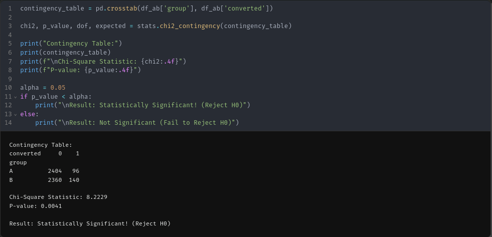

# Лабораторна робота: А/Б Тестування

**Мета:** Провести А/Б тестування для перевірки ефективності нового заклику до дії (Call to Action) у комп'ютерній грі.

## 1. Гіпотеза та Легенда

Ми — розробники безкоштовної інді-гри. Наша ціль — збільшити кількість добровільних пожертв (донатів) після проходження гри.

*   **Контекст:** Екран після титрів (Post-credits screen).
*   **Група А (Контрольна):** Стандартний текст: *"If you enjoyed the game, consider supporting us on Patreon."*
*   **Група Б (Тестова):** Емоційний текст: *"Thank you for playing... we wouldn't be able to finish this without you. Help us build the sequel!"*

**Формулювання гіпотези:**
> **ЯКЩО** ми замінимо сухий текст на емоційне звернення від розробників,
> **ТО** відсоток переходів на Patreon збільшиться,
> **ТОМУ ЩО** гравці, які щойно пройшли гру до кінця, мають емоційний зв'язок з продуктом і охочіше відгукнуться на особисте прохання.

## 2. Метрики

*   **Основна метрика:** Conversion Rate (CR) — відсоток гравців, які натиснули кнопку "Support Us".
*   **Критерій успіху:** Статистично значуще збільшення конверсії (p-value < 0.05).

## 3. Дизайн експерименту

Ми згенерували дані для двох незалежних вибірок гравців, які дійшли до фіналу гри.
*   **Розмір вибірки:** 2500 користувачів у кожній групі (разом 5000).
*   **Розподіл:** 50/50 (Рандомізація).

## 4. Результати

Після завершення експерименту ми отримали такі показники конверсії:

Візуально видно перевагу тестової групи (Б). Детальні цифри:
*   **Група А (Standard):** 3.84% конверсія (96 кліків).
*   **Група Б (Emotional):** 5.60% конверсія (140 кліків).

### Статистичний тест (Chi-Square)

Щоб перевірити, чи не є ця різниця випадковістю, ми використали критерій Хі-квадрат (Chi-Square Test).

**Таблиця спряженості (Contingency Table):**
| Група | Не клікнули (0) | Клікнули (1) |
| :--- | :--- | :--- |
| **A** | 2404 | 96 |
| **B** | 2360 | 140 |

**Результати тесту:**
*   **Chi-Square Statistic:** `8.2229`
*   **P-value:** `0.0041`

## 5. Висновки

1.  **Статистична значущість:** Отримане значення **P-value (0.0041)** є значно меншим за пороговий рівень значущості **alpha (0.05)**.
2.  **Інтерпретація:** Ми відкидаємо нульову гіпотезу. Різниця між групами є статистично значущою і не є результатом випадковості.
3.  **Бізнес-рішення:** Емоційний текст та обіцянка про сиквел (Група Б) показав відносний приріст конверсії на **~46%** порівняно зі стандартним текстом.
    *   *Рекомендація:* Впровадити емоційний варіант тексту для всіх користувачів у наступному патчі гри.
